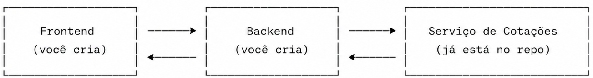
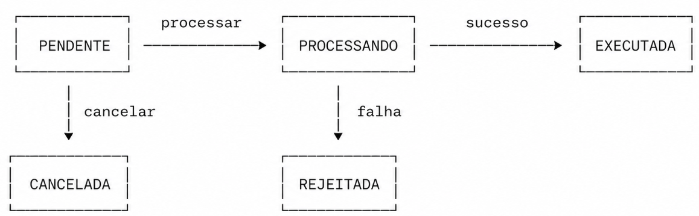

# 🚀 Desafio Técnico — Sistema de Ordens de Investimento

## Bem-vindo(a)!

Obrigado por participar do nosso processo seletivo! Este desafio foi pensado para avaliar suas habilidades de forma prática, simulando problemas reais do nosso dia a dia.

Leia este documento com calma antes de começar. Ele contém tudo que você precisa saber.

---

## Índice

- [Visão Geral](#visão-geral)
- [O que já está no repositório](#o-que-já-está-no-repositório)
- [Parte 1 — Código](#parte-1--código)
- [Parte 2 — Arquitetura AWS](#parte-2--arquitetura-aws)
- [Entregas esperadas](#entregas-esperadas)
- [Dicas](#dicas)

---

## Visão Geral

Sua missão é construir do zero um **Sistema de Ordens de Investimento** — composto por um **backend** e um **frontend** — que permita aos usuários comprar e vender ativos financeiros (ações, criptomoedas, etc.).

### O que você vai construir

| Camada    | O que fazer                  |
|-----------|------------------------------|
| Backend   | API de ordens em Node.js + TypeScript |
| Frontend  | Interface em Next.js ou Angular |

O sistema que você construir deve permitir que usuários:

- Visualizem ativos disponíveis e seus preços atuais
- Criem ordens de compra e venda
- Acompanhem o status das ordens em tempo real
- Visualizem seu saldo e histórico de operações

### O que já está pronto no repositório

O repositório inclui um **Serviço de Cotações** que você **não precisa implementar** — apenas consumir.

Ele simula um fornecedor externo de preços de ativos. Seu backend vai consultá-lo durante o processamento das ordens para obter o preço atual de cada ativo.

> ⚠️ Esse serviço é **intencionalmente instável**: falha de forma aleatória e tem latência variável. Sua solução precisa lidar com isso.



### Ciclo de vida de uma ordem



> ⚠️ **Este desafio tem duas partes independentes.** Elas compartilham o mesmo contexto de negócio, mas têm objetivos de avaliação distintos. O que você desenha na arquitetura não precisa estar implementado no código, e vice-versa.

---

## O que já está no repositório

### Como rodar o serviço de cotações

```bash
cd quotation-service
npm install
npm start
```

O serviço estará disponível em `http://localhost:3001`.

> **Node.js 18 ou superior** é necessário para rodar o serviço.

### Endpoints disponíveis

| Método | Endpoint               | Descrição                              |
|--------|------------------------|----------------------------------------|
| GET    | `/quotations`          | Lista todas as cotações                |
| GET    | `/quotations/:symbol`  | Retorna cotação de um ativo específico |
| GET    | `/health`              | Verifica se o serviço está no ar       |

### ⚠️ Comportamento intencional do serviço

Como mencionado na visão geral, esse serviço **falha aleatoriamente** e **tem latência variável**. Isso é proposital. Sua solução precisa continuar funcionando mesmo quando ele falhar — e você vai documentar como tratou isso.

---

## Parte 1 — Código

### Stack obrigatória

| Tecnologia      | Requisito                             |
|-----------------|---------------------------------------|
| TypeScript      | Obrigatório no backend                |
| Node.js         | Runtime do backend                    |
| Next.js ou Angular | Escolha um para o frontend         |
| Banco de dados  | Sua escolha (PostgreSQL, MongoDB, etc.) |
| Testes          | Unitários e de integração             |

### O que você precisa construir

#### Backend — API de Ordens

Implemente os seguintes comportamentos:

1. **Listar ativos disponíveis** com cotação atual - ok
2. **Criar uma ordem** de compra ou venda - ok
3. **Listar ordens do usuário** - ok
4. **Detalhar uma ordem** específica - ok 
5. **Cancelar uma ordem** pendente - ok
6. **Consultar posição do usuário** em cada ativo (saldo) - ok

#### Regras de negócio

**Criação de ordem:**
- Uma ordem deve conter: símbolo, tipo (COMPRA ou VENDA), quantidade e preço
- Ordens de venda só podem ser criadas se o usuário tiver saldo suficiente do ativo
- Ao ser criada, a ordem entra com status **PENDENTE**

**Processamento de ordem:**
- O sistema deve consultar o serviço de cotações para obter o preço atual
- O sistema deve ser **resiliente a falhas** do serviço de cotações — documente como você tratou isso
- Após o processamento com sucesso, o status muda para **EXECUTADA**
- Em caso de falha no processamento, o status muda para **REJEITADA**

**Cancelamento:**
- Ordens com status **PENDENTE** podem ser canceladas
- Ordens **PROCESSANDO** ou **EXECUTADAS** não podem ser canceladas

**Saldo:**
- Ao executar uma compra, a quantidade do ativo **aumenta**
- Ao executar uma venda, a quantidade do ativo **diminui**

#### Frontend — Interface do usuário

Implemente as seguintes telas/funcionalidades:

| Funcionalidade       | Descrição                                                       |
|----------------------|-----------------------------------------------------------------|
| Lista de ativos      | Exibe ativos disponíveis com preço atual e botão para criar ordem |
| Lista de ordens      | Exibe ordens com status, permite filtrar e cancelar             |
| Posição do usuário   | Visão consolidada do saldo em cada ativo                        |
| Formulário de ordem  | Modal ou página para criar uma nova ordem                       |

> O frontend não precisa ser visualmente elaborado. Foque em funcionalidade e usabilidade. Sinta-se à vontade para usar bibliotecas de componentes como Material UI, Tailwind, PrimeNG, etc.

---

### Dados iniciais (seed)

Ao rodar o projeto, popule o banco com os dados abaixo:

#### Ativos disponíveis

| Símbolo | Nome              | Cotação de referência |
|---------|-------------------|----------------------|
| ITUB4   | Itaú Unibanco PN  | R$ 32,80             |
| ITUB3   | Itaú Unibanco ON  | R$ 15,40             |
| USDC    | USD Coin          | R$ 5,50              |
| SOL     | Solana            | R$ 418,07            |
| BTC     | Bitcoin           | R$ 350.000,00        |
| ETH     | Ethereum          | R$ 18.500,00         |

#### Usuário de teste

| ID       | Nome             |
|----------|------------------|
| user-001 | João Investidor  |

#### Saldo inicial do usuário

| Símbolo | Quantidade | Preço médio |
|---------|------------|-------------|
| ITUB4   | 100        | R$ 30,00    |
| USDC    | 50         | R$ 3,94     |

> Fique à vontade para adicionar mais ativos ou usuários se quiser.

---

### Cenário de concorrência — pense sobre isso

Considere a seguinte situação:

> *João tem 100 unidades de ITUB4. No mesmo instante, ele envia duas ordens de venda de 80 unidades cada.*

Responda na documentação:
- O que deveria acontecer?
- O que a sua implementação faz nesse caso?
- Quais são os trade-offs da sua abordagem?

---

### Sugestões ao fornecedor de cotações

O serviço de cotações simula um fornecedor externo instável. Pense: se você pudesse solicitar melhorias a esse fornecedor, o que pediria para facilitar a integração e aumentar a resiliência do seu sistema?

Documente suas sugestões e explique o benefício de cada uma.

---

### O que avaliaremos na Parte 1

| Critério                        | O que observamos                                                                                          |
|---------------------------------|-----------------------------------------------------------------------------------------------------------|
| **Regras de negócio**           | As regras de negócio estão implementadas corretamente e de forma completa?                               |
| **Resiliência**                 | O sistema continua funcionando quando o serviço de cotações falha?                                       |
| **Tratamento de concorrência**  | Ordens simultâneas conflitantes são tratadas de forma consistente?                                       |
| **Qualidade do código**         | O código é legível, organizado e segue boas práticas gerais de desenvolvimento? Os patterns adotados fazem sentido para o problema? |
| **Logs**                        | Os logs são claros, bem classificados e úteis para operar e investigar o sistema?   |
| **Testes**                      | Os testes cobrem casos relevantes, incluindo falhas e cenários de borda?                                 |
| **Documentação**                | O README explica claramente como rodar o projeto e as decisões técnicas tomadas?                         |

---

### Documentação esperada — Parte 1 (no seu README)

Inclua no README do seu repositório:

1. **Como executar o projeto** — passo a passo para rodar backend, frontend e o serviço de cotações. Inclua versões necessárias (Node, etc.)
2. **Tratamento de concorrência** — como você abordou o cenário das ordens simultâneas e os trade-offs da sua solução
3. **Tratamento de falhas** — o que acontece quando o serviço de cotações falha? O que acontece com a ordem do cliente?
4. **Sugestões ao fornecedor** — melhorias que você solicitaria ao serviço de cotações externo
5. **Decisões e trade-offs** — o que você priorizou, o que ficou de fora, o que faria diferente com mais tempo
6. **Premissas assumidas** — se algo não ficou claro no enunciado, documente o que você assumiu e por quê

---

## Parte 2 — Arquitetura AWS

Nesta parte, você não precisa escrever código. O objetivo é avaliar como você pensa em sistemas escaláveis, resilientes e preparados para crescer.

> Você pode (e deve) incluir no diagrama componentes que **não estão implementados no código**. Esta parte é independente.

---

### Contexto do produto

O sistema de ordens que você implementou na Parte 1 é a versão inicial de um produto que vai crescer. Ao desenhar a arquitetura, considere que:

**O volume será significativo desde o início:**

| Métrica                       | Volume        |
|------------------------------|---------------|
| Ordens por segundo           | ~1.000        |
| Usuários simultâneos         | ~50.000       |
| Consultas de cotação/segundo | ~10.000       |

**O produto vai evoluir:**
- Hoje dependemos de um único provedor externo de cotações. No roadmap, outros provedores serão integrados — por redundância ou por cobertura de novos mercados.
- Hoje operamos com ações e criptomoedas. Novos tipos de ativos serão adicionados ao longo do tempo.

**O contexto é financeiro:**
Estamos lidando com o dinheiro dos clientes. Qualquer inconsistência no processamento de uma ordem — seja por falha, por sobrecarga ou por indisponibilidade de um componente — tem impacto direto e real na vida das pessoas. A arquitetura precisa refletir essa responsabilidade.

**A dependência externa é instável:**
O serviço de cotações é de terceiros. Ele falha, tem latência variável e não está sob nosso controle. O sistema precisa continuar operando de forma segura mesmo quando essa dependência não responde.

---

### O que você precisa entregar

Um **diagrama de arquitetura AWS** mostrando como essa solução rodaria em produção, acompanhado de documentação escrita.

O diagrama pode ser feito em qualquer ferramenta. O importante é ser legível e ter legenda.

---

### O que avaliaremos na Parte 2

| Critério                    | O que observamos                                                                                     |
|-----------------------------|------------------------------------------------------------------------------------------------------|
| **Escolha de serviços**     | Os serviços AWS escolhidos fazem sentido para o problema? As alternativas foram consideradas?        |
| **Escalabilidade**          | A arquitetura aguenta os volumes descritos? Os gargalos estão identificados?                         |
| **Resiliência**             | O sistema continua operando com segurança quando componentes falham?                                 |
| **Integridade financeira**  | A arquitetura garante que operações sobre o dinheiro dos clientes sejam confiáveis e rastreáveis?   |
| **Visão de produto**        | O design suporta a evolução do produto sem grandes refatorações?                                     |
| **Segurança**               | A arquitetura trata adequadamente autenticação, autorização e proteção de dados?                     |
| **Observabilidade**         | É possível operar, monitorar e investigar incidentes nesse sistema?                                  |

> ⚠️ Este diagrama será discutido em profundidade na entrevista técnica. Prepare-se para explicar suas decisões.

---

### Documentação esperada — Parte 2

Inclua um arquivo separado (ex: `ARCHITECTURE.md`) com:

1. **Diagrama de arquitetura** com legenda explicando cada componente e sua função
2. **Justificativa das escolhas** — por que cada serviço AWS foi escolhido? Quais alternativas você considerou e por que descartou?
3. **Como a arquitetura escala** — como cada camada se comporta sob os volumes descritos? Onde estão os gargalos?
4. **Como a arquitetura lida com falhas** — o que acontece quando componentes ficam indisponíveis? Como o sistema se recupera?
5. **Como o produto evolui sobre essa arquitetura** — o que muda quando um segundo provedor de cotações for integrado? E quando um novo tipo de ativo for adicionado?
6. **Segurança** — como a arquitetura protege os dados e as operações dos clientes?
7. **Observabilidade** — imagine que você recebe o alerta: *"ordens não estão sendo processadas"*. Como você investigaria? Quais logs, métricas ou alarmes te ajudariam?
8. **Estimativa de custos** — uma estimativa aproximada dos principais componentes

---

## Entregas esperadas

| Entrega              | Descrição                                               |
|---------------------|----------------------------------------------------------|
| Repositório GitHub  | Código-fonte do projeto                                  |
| Backend funcional   | API em Node.js + TypeScript                              |
| Frontend funcional  | Next.js ou Angular                                       |
| Testes              | Unitários + integração                                   |
| `README.md`         | Documentação da Parte 1 (como rodar + decisões técnicas) |
| `ARCHITECTURE.md`   | Diagrama e documentação da Parte 2                       |

---

## Dicas

**Se não der tempo de implementar tudo, documente.**
Descreva o que você faria e como faria. Valorizamos o raciocínio tanto quanto o código pronto.

**Teste seu ambiente antes de entregar.**
Clone seu repositório em uma pasta diferente e siga suas próprias instruções do zero. Se algo não funcionar, você ainda tem tempo de ajustar.

**Prepare-se para a entrevista.**
Você vai precisar explicar suas decisões — tanto de código quanto de arquitetura. Pense nos trade-offs de cada escolha.

---

Boa sorte! 🚀


