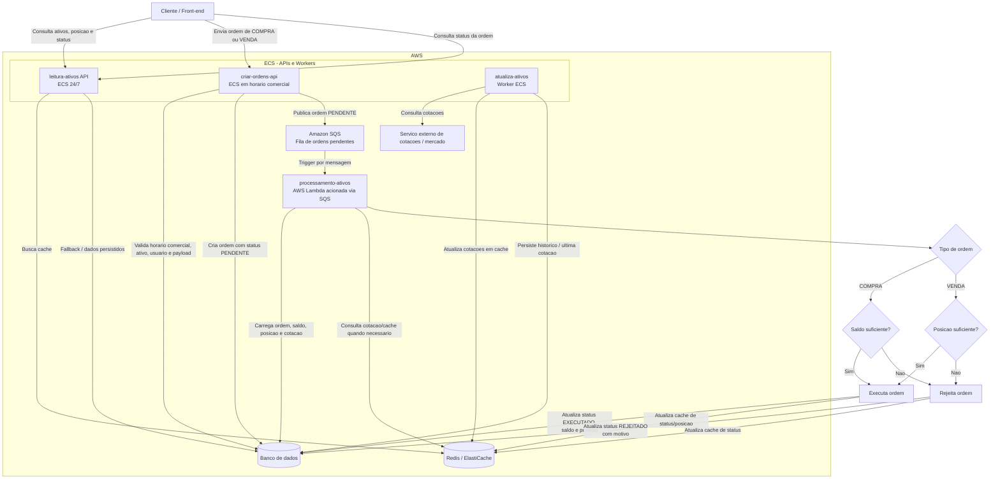

1. cd case-eng-dist
2. cd quotation-service
3. npm install
4. npm run dev
5. docker compose up -d --build

Teste de performance - Estruturação
Cenário 1: De 0 a 50.000 em 20 minutos, execução por 30 minutos.
Cenário 2: Stress Test 0 a 75.000 usuário em menos de 5 minutos, para simular o comportamento do sistema
Cenário 3: Soak Test por 4 horas para ver o comportamento da aplicação durante o dia. 
Cenário 4: Spike Test com picos de 100.000 clientes para simular abertura de mercado e recuperação do sistema após o pico. 

Teste integrado: E2E
Sucesso
1. Consulta os ativos na api "leitura ativos"
2. Cria a ordem na api "criar ordens"
3. Consulta o status de processamento - Espero EXECUTADO

Erro
1. Consulta os ativos na api "leitura ativos"
2. Cria a ordem na api "criar ordens"
3. Mock do saldo do cliente insuficiente para a operação (Compra)
4. Consulta o status de processamento - Espero REJEITADO

Erro
1. Consulta os ativos na api "leitura ativos"
2. Erro ao criar a ordem na api "criar ordens"
3. Não cria a ordem. 

Erro
1. Redis fica fora do ar
2. Consulta no banco de dados na api "leitura ativos"
3. Cria a ordem na api "criar ordens" 
4. Consulta o status de processamento - Espero EXECUTADO

Teste sintético
Atualiza-ativos
Cenário: 
1. Deploy sobe
2. Teste sintético aguarda 5 minutos
3. Consulta o dado no banco de dados e Redis
4. Valida que o timestamp ou valor mudou dentro do esperado
5. Passa ou falha a pipeline

Criar-ordens 
Cenário:
1. Envia uma ordem
2. Valida que voltou 201 com status PENDENTE
3. Valida se salvou no banco

Leitura-ativos:
Cenário:
1. Consulta cotação de um ativo conhecido no redis
2. Consulta status de uma ordem no redis e banco de dados
3. Consulta posição do usuário no redis e banco de dados
4. Valida 200 com dados coerentes

Processamento-ativos
Cenário:
1. Publica uma ordem PENDENTE no SQS
2. Aguarda o tempo médio de processamento
3. Consulta o status — valida que foi para EXECUTADO
4. Tenta cancelar — valida que retorna erro (já executada)

1. Publica uma ordem PENDENTE no SQS
3. Consulta o status — valida que está PENDENTE ainda
4. Cancela a ordem 
5. Ordem finaliza com status CANCELADO

Fluxograma AWS - fluxo de compra ou venda de ordem

Resumo do fluxo:
1. O cliente consulta ativos, posicao e status pela API `leitura-ativos`, que fica 24/7 no ECS.
2. O worker `atualiza-ativos`, tambem em ECS, atualiza cotacoes no Redis e no banco.
3. Em horario comercial, o cliente envia uma ordem de compra ou venda para `criar-ordens-api`, em ECS.
4. A API cria a ordem como `PENDENTE`, persiste no banco e publica a mensagem no SQS.
5. O SQS aciona a Lambda `processamento-ativos`.
6. A Lambda valida a ordem: compra exige saldo suficiente; venda exige posicao suficiente.
7. A ordem termina como `EXECUTADO` ou `REJEITADO`, e a consulta final acontece pela API `leitura-ativos`.

Docs por peça
leituta ativos
GET /                       health check
GET /quotations             lista todos os ativos/cotações
GET /quotations/:symbol     busca cotação de um ativo
GET /orders?userId=...      lista ordens de um usuário
GET /orders/:id             busca uma ordem específica
GET /positions?userId=...   lista posições/carteira do usuário

QuotationController
  -> QuotationService
    -> Redis busca cotações/preços
    -> Prisma/MySQL só entra se o Redis falhar com erro

OrderController
  -> valida se userId veio na query
  -> OrderService.listByUser(userId)
    -> Prisma consulta tabela orders
    -> ordena por createdAt desc
  -> retorna lista de ordens

PositionController
  -> valida userId
  -> PositionService.listByUser(userId)
    -> Prisma consulta positions
    -> Prisma faz include do asset via relation Position.asset
    -> usa asset.name e asset.referencePrice
    -> calcula profit_loss
    -> ordena por quantity * current_price
  -> retorna carteirak

profit_loss = quantity * (current_price - average_price)

criar ordens api
tem comandos SQL atomicos para garantir a não venda de um mesmo ativo sem estoque
GET  /health  health check
POST /criar-ordens cria uma ordem de compra ou venda 
POST /orders/:id/cancel cancela uma ordem de compra ou venda

O OrderController valida campos obrigatórios.
Valida se type é COMPRA ou VENDA.
Valida se quantity e price são positivos.
Chama OrderService.createOrder.
O serviço busca o saldo mockado do usuário via BalanceService.
Para COMPRA, verifica se cash >= quantity * price.
Para VENDA, verifica se o usuário tem quantidade suficiente do ativo.
Se passar na validação, cria a ordem no MySQL com status PENDENTE.
Envia uma mensagem para a fila SQS orders-queue.
Retorna 201 com success: true, orderId e status: "PENDENTE".

processamento-ativos
lambda para executar e cancelar ordens. 
só aceita mensagens com status PENDENTE ou CANCELADA, outros status sao cancelados
Para garatir atomicidade, ele valida atraves do update many, se a quantidade de linhas alteradas === 0, sinal que já foi processada, caputurada por outra lambda, cancelada ou rejeitada e por isso é tratada como duplicada e entao ignorada. 

Para COMPRA:

busca a posição atual do usuário para aquele ativo;
se existir, soma a quantidade comprada;
recalcula o preço médio;
atualiza quantity, averagePrice e totalValue;
se não existir, cria uma nova posição.

Para VENDA:

faz decremento atômico com condição:
userId = userId
symbol = symbol
quantity >= quantidade_da_venda
se nenhuma linha for atualizada, considera saldo insuficiente e rejeita a ordem.

Se a posição foi atualizada com sucesso:

PROCESSANDO -> EXECUTADA
Se der erro no processamento:

-> REJEITADA

worker atualiza ativos
